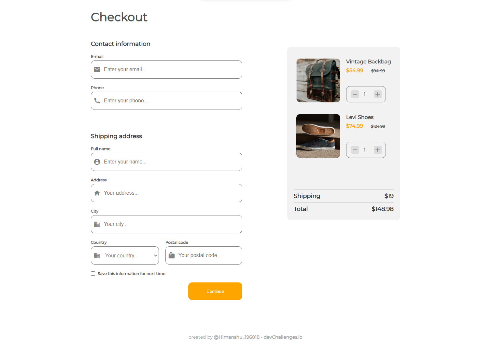

<!-- Please update value in the {}  -->

<h1 align="center">{Your Project Name}</h1>

   Solution for a challenge from  <a href="http://devchallenges.io" target="_blank">Devchallenges.io</a>.

  <h3>
    <a href="{DEMO LINK}">
      Demo
    </a>
     | 
    <a href="{REPO LINK}">
      Solution
    </a>
     | 
    <a href="{CHALLANGE LINK}">
      Challenge
    </a>
  </h3>

<!-- TABLE OF CONTENTS -->

## Table of Contents

- [Overview](#overview)
- [Built With](#built-with)
- [Features](#features)
- [Contact](#contact)
- [Acknowledgements](#acknowledgements)

<!-- OVERVIEW -->

## Overview

This project is solution to the challenge to build {TITLE OF PAGE} at <a href="http://devchallenges.io" target="_blank">Devchallenges.io</a>. It is a responsive web page showcasing {FEATURE}. I have successfully completed this challange and deployed the web page successfully.

- You can view deployed page <a href="{LINK TO DEMO}">here</a>.

- This challange was better for improving skills for placing elements at different locations and working with multiple images. It was a wonderfull experience for me. I faced many challenges during this one challange but got a lot of experince from building it.

- From this challange, I have learned better positioning of the elemnts using css. I also leanred flex and grid layout somewhat and how to use them. I came to know that it is better to designed unit(smallest) elements first which improve the placement of other elements.

- Hit and trial is best when learning at a beginner level, after some time you will get the idea what is happening and gain better understanding for desingning a web page. Which will improve your overall skills and improve your pace of work. Keep building keep trying.

### Built With

<!-- This section should list any major frameworks that you built your project using. Here are a few examples.-->

- [HTML]
- [CSS]

## Features

<!-- List the features of your application or follow the template. Don't share the figma file here :) -->

This application/site was created as a submission to a [DevChallenges](https://devchallenges.io/challenges) challenge. The [challenge]({CHALLENGE LINK}) was to build an application/site to complete the given user stories.

## Acknowledgements

<!-- This section should list any articles or add-ons/plugins that helps you to complete the project. This is optional but it will help you in the future. For exmpale -->

- [Steps to replicate a design with only HTML and CSS](https://devchallenges-blogs.web.app/how-to-replicate-design/)
- [Node.js](https://nodejs.org/)
- [Marked - a markdown parser](https://github.com/chjj/marked)

## Contact

- Website [My-website.com](https://{your-web-site-link})
- GitHub [@Himanshu_2301](https://github.com/Himanshu-196018)
- LinkedIn [@Himanshu](https://www.linkedin.com/in/himanshu-kumar-2b7993167)
